<h3><code>guilhermeFin@github ~ $ ./contributions.sh</code></h3>

  
<h3><code>guilhermeFin@github ~ $ whoami</code></h3>
<table>
<tr>
<td valign="top"></td>
<td valign="top"></td>
</tr>
</table>

Notes
- Replace the placeholder lines in scripts/make_info_card.py (Role, Stack, Highlights) with your real info.
- The Action re-scrapes your public contributions daily and commits data/contributions.json + contrib-heatmap.svg.
- Locally: if you want to regenerate the portrait, create a venv and install dev deps:
  - python -m venv .venv
  - source .venv/bin/activate
  - pip install -r scripts/requirements-dev.txt
  - python scripts/prep_photo.py /path/to/photo.jpg
  - python scripts/make_ascii_svg.py
  - python scripts/make_info_card.py
- The CI workflow only installs the small deps (requests, beautifulsoup4) so rembg/opencv are not required in Actions.